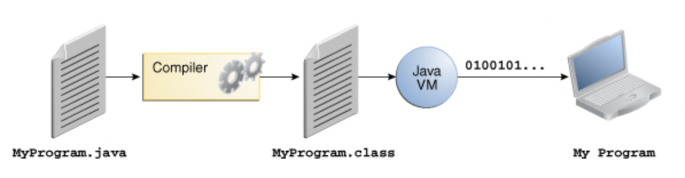

### JVM이란 무엇인가
JVM 은 Java Virtual Machine 약자로, 자바 바이트코드를 실행하는 주체입니다.
간단히 Java Platform을 위한 Virtual Machine이라고 할 수 있습니다.



맨 앞의 ```.java 파일```은 javac compiler에 의해 ```.class 파일```로 컴파일 됩니다.
이 ```.class 파일```은 소스코드가 아닌 바이트코드로 이루어져 있습니다.
이 바이트코드(bytecodes)는 JVM가 이해햘 수 있는 언어로 이루어져 있습니다.

JVM의 인스턴스는 이 바이트코드를 (우리의 어플리케이션)을 실행시킵니다.

### 컴파일 하는 방법 & 실행 방법
컴파일은 java compiler를 이용하면 됩니다.
linux 환경에서 javac 명령어를 이용하면 ```.class``` 파일을 만들 수 있습니다.

### 바이트코드란 무엇인가
바이트코드는 java compiler가 컴파일하고 난 파일로
사람이 이해할 수 있는 소스코드에서 JVM이 이해할 수 있는 코드로 변환된 결과물입니다.

### JIT 컴파일러란 무엇이며 어떻게 동작하는지
JIT 컴파일러란 Just In Time 컴파일러로,
프로그램을 실제 실행되는 시점에 기계어로 변환하는 컴파일 기법입니다.

javac compiler의 결과물인 바이트코드를 읽어 기계어로 변환하는 역할을 합니다.
기계어로 변환된 코드는 캐시에 저장되기 때문에 재사용시 컴파일을 다시할 필요는 없습니다.

* 다른 컴파일 방법
  * 인터프리트 방식 : 프로그램 코드를 읽어가면서 기계어로 실행 (e.g. python)
  * 정적 컴파일 방식 : static compilation, 실행 전에 미리 기계어로 번역 해놓음 (e.g. C)

JIT 컴파일러는 두 가지의 방식을 혼합한 방식이라 생각 할 수 있는데, 실행 시점에서 인터프리트 방식으로 기계어 코드를 생성하면서 그 코드를 캐싱하여, 같은 함수가 여러 번 불릴 때 매번 기계어 코드를 생성하는 것을 방지합니다.

### JVM 구성 요소


구성 요소로는 위에 보는 바와 같습니다.
* Class loader
  * 런타임에 한번만 호출되고, 자바 런타임 환경의 일부(JRE)
  * .class 파일들을 읽고, 바이너리 데이터를 생성해 method area에 저장
* Meathod area
  * 클래스 정보들이 저장됨 (클래스 이름, 변수명, static 변수들 등등)
  * 하나의 jvm에 하나의 method area
  * It is a shared resource
* Heap area
  * 모든 오브젝트의 정보들이 저장됨
  * one Heap per one JVM
  * It is a shared resource
* Stack area
  * For every thread, JVM이 모든 thread마다 하나의 run-time stack을 생성
  * It is not a shared resource
* PC registers
  * 현재 실행되는 thread 의 실행 지시 주소 저장
  * 각 thread별로 별도의 pc register을 지님
* Native method stacks
  * For every thread, a separate native stack is created. It stores native method information. 


### JDK와 JRE의 차이
* JRE(Java Runtime Environment)로 자바파일 실행을 위한 패키지.
* JDK(Java Development Kit)로 JRE+ 자바 개발을 위한 툴(java,javac)을 포함
### 

출처 : 오라클 공식 문서
https://docs.oracle.com/javase/tutorial/getStarted/index.html
참고 : https://www.geeksforgeeks.org/jvm-works-jvm-architecture